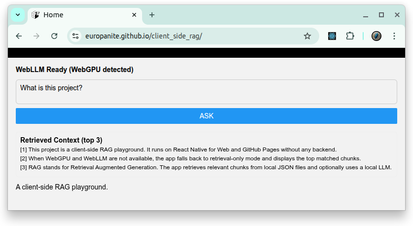

# [Client Side RAG](https://github.com/europanite/client_side_rag "Client Side RAG")

Client Side Browseer Based RAG. 



---

## 🚀 Getting Started

### 1. Prerequisites
- [Docker Compose](https://docs.docker.com/compose/)

### 2. Build and start all services:

```bash
# set environment variables:
export REACT_NATIVE_PACKAGER_HOSTNAME=192.168.3.6

# Build the image
docker compose build

# Run the container
docker compose up
```

---